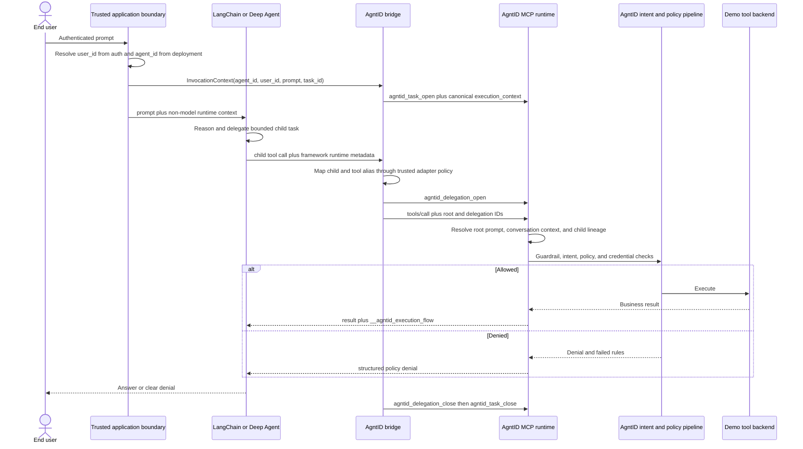

# Architecture and ownership boundary

## End-to-end execution

The POC uses a persistent MCP session so task open, tool calls, and task close
reach the same runtime session. One task is created for each user prompt. Every
tool call in that agent run receives the same trusted task ID.

## Who owns what

| Concern | LangChain / Deep Agents | POC application bridge | AgntID | Tool provider |
|---|---|---|---|---|
| Prompt/messages and model calls | Owns | Supplies trusted runtime context | Observes prompt through task glue | No |
| Reasoning and tool selection | Owns | Restricts exposed tool allowlist | Does not choose the tool | No |
| Planning, filesystem, subagents, context management | Deep Agents owns | Configures and adapts bounded lineage | Consumes canonical context, not framework objects | No |
| End-user authentication | No | Must resolve verified subject | Should consume/bind verified identity | No |
| Stable agent identity | No built-in security identity | Loads deployment identity | Records and should authenticate it | No |
| Prompt-to-tool correlation | Carries runtime context | Opens task and injects task ID | Resolves task to user, agent, prompt | No |
| Intent validation and policy | Not an enforcement boundary | Must not bypass | Owns | No |
| Guardrails and credential brokering | Optional middleware only | No | Owns | Consumes scoped credential/call |
| Tool execution audit | Basic callbacks/traces | Displays returned metadata | Owns authoritative audit | May log backend details |
| Business operation | Calls | No | Mediates | Owns |
| Final answer and UX | Owns | Renders | Returns evidence | No |

LangChain's tool allowlist reduces what the model can see. It is useful defense
in depth, but AgntID remains the enforcement point because model behavior and
framework configuration are application-controlled.

## Identity model in this POC

| Identifier | Meaning | Lifetime | Trusted source in production |
|---|---|---|---|
| `agent_id` | Logical agent/deployment performing work | Stable across runs | Deployment config, workload token, or AgntID registration |
| `user_id` | Human or service principal behind the prompt | Stable subject | Verified OIDC/session claim, never prompt text |
| `task_id` | One prompt and all resulting tool calls | One invocation | Generated by the application bridge |
| `delegation_id` | One bounded child task and its tool calls | Child delegation | Generated deterministically by the trusted adapter |
| `acting_agent_id` | Stable identity mapped from one framework child | Stable child policy | Trusted adapter configuration or workload identity |
| `event_id` | One AgntID audit event | One tool call | AgntID response |
| `correlation_id` | Cross-service execution correlation | One tool call/flow | AgntID response |
| `trace_id` | Demo backend trace | One backend execution | Tool result |
| `snapshot_id` | Policy/runtime state used for a decision | One decision | AgntID policy response |

The current local runtime uses open MCP transport. Therefore the POC proves
correlation and policy enforcement, but the caller's `agent_id` and `user_id`
are assertions made by the trusted application. A production design should
authenticate the workload and user, then have AgntID bind IDs from verified
claims instead of trusting arbitrary task-open fields.

## Recommended production identity levels

1. **POC assertion:** trusted app sends `agent_id`, `user_id`, prompt, and task.
2. **Authenticated agent:** an OAuth client, workload identity, or mTLS identity
   is mapped by AgntID to the registered agent; conflicting request fields are
   ignored.
3. **Delegated user:** a verified end-user subject is carried separately from
   the agent/workload subject so policy can evaluate both actor layers.
4. **Delegation lineage (implemented in this POC):** carry `parent_agent_id`,
   `root_task_id`, `acting_agent_id`, delegated intent, tool allowlist, and
   `delegation_id` when a framework dispatches subagents.
5. **Human approval lineage (transport implemented; verification pending):**
   record approver subject and approval event for sensitive tool calls while
   preserving the original user and agent.

## Why the primary POC uses Deep Agents

The service-operations demo specifically exercises the larger harness: a
checkpointed conversation, filesystem-backed long-term memory, planning files,
specialist subagents, context quarantine, and human approval. That is the
realistic integration under evaluation.

The small `create_agent` runner remains only as a transport diagnostic. It is
useful when isolating MCP adapter problems, but it is not the product demo or
the basis for the engineering findings.
